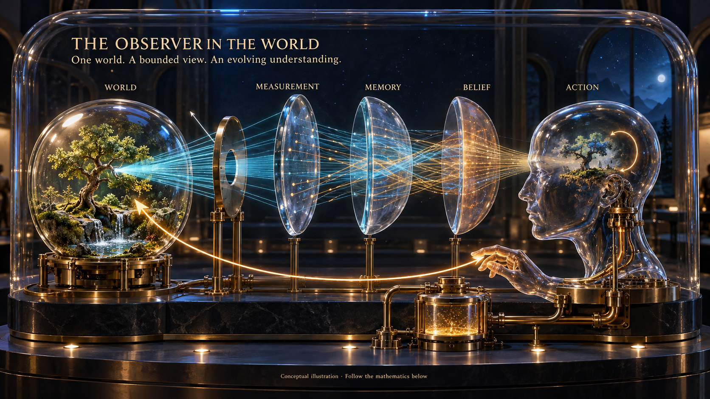

# Through the observer’s lens

[← The whole programme](https://boundedness-atlas.madmanmuzza.chatgpt.site) · [Current technical loop](observer-world-loop.svg) · [Honesty](HONESTY.md) · [Mathematics & sources](#follow-the-mathematics)

**A finite part of the world builds a usable picture of the world—and acts through that picture.** What reaches it, what it remembers, what it believes and what its body can do are connected, but they are not interchangeable.

Start at the tree. Follow the blue signals through the aperture and layered glass. Compare the tree with the reconstruction inside the observer. Then follow the amber action back to the world. The scientific question is: **which differences does this observer lose, and when do those differences matter?**

This is the evolving synthesis of the Boundedness Atlas. The full programme—its mathematics, biology, contributions and predictions—remains the starting point. This page shows how those strands currently meet.

AI-generated 3D illustration, not a physical simulation or image of consciousness. The lens curvature is a visual metaphor for measurement and representation. No claim that observation necessarily falsifies a reading, or that belief bends spacetime. The equations below specify the actual relationships.

## Follow the mathematics

[L01 One world, different accessible views](#l01) · [L02 The lens](#l02) · [L03 Memory](#l03) · [L04 Belief](#l04) · [L05 Reflection](#l05) · [L06 Geometry](#l06) · [L07 The body makes some futures possible](#l07) · [L08 Reflection on a belief, and interaction between observers](#l08) · [L09 The programme changes its picture when evidence earns it](#l09)

### L01 · One world, different accessible views

**Operational definition and conditional theorem.**

The observer is inside the system being studied. A viewpoint specifies the histories, interventions, recording channel, time horizon and experimental regime it can access:

$$\mathcal J_O=(\mathcal H,\mathcal U,\mathcal Y,T,\Pi).$$

This is the paper's operational jurisdiction, not a complete definition of a conscious person. A different sensor or time horizon can reveal distinctions that were invisible before. The glass enclosure in the image means shared physical context; its shape is not a proposed boundary of the universe.

**What would require revision:** Changing the accessible interventions, horizon or recording channel changes the jurisdiction; an old state claim must be reassessed.

**Source:** [The Observer and the World: Predictive state, lawful forgetting, and the geometry of empirical reality](https://boundedness-atlas.madmanmuzza.chatgpt.site/papers/current-07/) · PDF 3, 4, 5, 6

### L02 · The lens: what a measurement erases

**Exact projective result under additional premises.**

Suppose two positive quantities are visible only through their ratio. Common scale disappears:

$$q=z_1/z_2,\qquad x=\frac{z_1-z_2}{z_1+z_2}\in(-1,1).$$

If the hidden pair evolves by a homogeneous linear map $z'=Mz$, with $M=\begin{pmatrix}a&b\\c&d\end{pmatrix}$, then

$$q'=\frac{aq+b}{cq+d}.$$

The matrix must be invertible, keep the admitted components positive and avoid a zero denominator. Cross-ratios of four distinct points are then preserved. This is a precise way in which a geometry arises at the observer–world interface. It does not say thought bends spacetime.

**Try the idea mentally:** $(1,1)$ and $(10,10)$ both appear as $x=0$. They contain different totals. If a later response depends on the total, this one-number view is missing a relevant state. The curved glass represents the observation map, not a claim that every measurement distorts every truth.

**What would require revision:** A reproducible cross-ratio violation beyond uncertainty rejects this projective branch after point-state adequacy has been checked. Boundedness alone does not select it.

**Source:** [The Observer and the World: Predictive state, lawful forgetting, and the geometry of empirical reality](https://boundedness-atlas.madmanmuzza.chatgpt.site/papers/current-07/) · PDF 9, 10

### L03 · Memory: what may safely be forgotten

**Conditional factorization theorem.**

A record $x(h)$ is sufficient only if histories it merges have the same future laws for every admitted intervention:

$$x(h_1)=x(h_2)\;\Rightarrow\;K_u(h_1,B)=K_u(h_2,B).$$

The lawful compression is the predictive equivalence class of histories. If equal-looking presents have different futures, the representation must retain an additional distinction. Applying a clever transformation to the same insufficient number cannot recover erased information. The layered amber traces show history retained where future tests require it. Temporal order and association of signals are distinct from the algebraic axiom of associativity.

**What would require revision:** Find matched present records with different future distributions under the same declared intervention. Exact measurable factorization also needs the source theorem’s measurable-space conditions.

**Source:** [The Observer and the World: Predictive state, lawful forgetting, and the geometry of empirical reality](https://boundedness-atlas.madmanmuzza.chatgpt.site/papers/current-07/) · PDF 4, 5, 6; [Predictive Closure: State, action, and the experimental compression of history](https://boundedness-atlas.madmanmuzza.chatgpt.site/papers/current-10/) · PDF 1

### L04 · Belief: the bounded coordinate and the evidence behind it

**Bayesian identity; biological realization remains to be tested.**

For a binary hypothesis, let $p\in(0,1)$ and $s=2p-1$. Its rapidity is **half** the log odds:

$$\lambda=\mathrm{artanh}(s)=\tfrac12\log\frac{p}{1-p}.$$

For a positive finite likelihood ratio $L$, Bayes gives

$$\lambda'=\lambda+\tfrac12\log L,\qquad s'=\frac{s+e}{1+se},\quad e=\frac{L-1}{L+1}.$$

The likelihood ratio must be conditional on evidence already used; correlated evidence cannot be counted repeatedly as independent. Interior priors and finitely many finite positive likelihood ratios remain interior. That mathematical statement does not prohibit people from reporting certainty.

The small tree inside the head is an inferred representation: it can be incomplete, well calibrated or mistaken. Confidence is not truth. The same observation can move different priors to different posterior beliefs.

**What would require revision:** A behavioural or neural application needs a calibrated mapping from measured signals to belief and evidence. A coordinate identity alone cannot establish that the brain uses this implementation.

**Source:** [Rapidity Coordinates for Bounded Belief,A Resource-Constrained Predictive Processing Framework with a Falsifiable Inter-Brain Synchrony Test](https://boundedness-atlas.madmanmuzza.chatgpt.site/papers/legacy-6774878/) · PDF 8, 9, 10, 11

### L05 · Reflection: a real physical branch

**Standard physical cascade calculation within stated optical conditions.**

Physical reflection is a wave interaction, not introspection. A terminated two-port has

$$\Gamma_{\rm in}=S_{11}+\frac{S_{12}S_{21}\Gamma_L}{1-S_{22}\Gamma_L}.$$

Here the scattering coefficients, reference impedance, frequency and load must be specified. For an ideal normal-incidence quarter-wave stack with $N$ high/low **pairs**, lossless media, design wavelength and equal incident/substrate admittances, the power reflectance is

$$R_N=\tanh^2\!\left(N\log\frac{n_H}{n_L}\right).$$

The composition viewpoint makes repeated layers economical to calculate; Maxwell/transfer-matrix physics still fixes the per-pair input. The reflected ray in the artwork locates this physical branch. It is not a ray-traced solution of that stack.

**What would require revision:** Loss, unequal exterior media, oblique incidence or departure from design wavelength require the fuller optical model. The shared tanh form does not make belief an electromagnetic reflection coefficient.

**Source:** [Bounded Reflection and Möbius Composition: A First-Principles Derivation](https://boundedness-atlas.madmanmuzza.chatgpt.site/papers/legacy-6767896/) · PDF 3, 9, 10

### L06 · Geometry: related structures need different physical bridges

**Different conditional structures; no universal curvature claim.**

For Bernoulli belief, the Fisher line element in $s$ is

$$d\ell_F^2=\frac{ds^2}{1-s^2}.$$

The belief manuscript additionally considers the chosen effective metric

$$d\ell_{\rm eff}^2=\frac{ds^2}{(1-s^2)^2}=d\lambda^2.$$

These are different metrics. A logarithmic resource barrier is a model choice; it does not by itself fix a physical metric or a kinetic law. If $\dot\lambda=\Phi$ is specified, the chain rule gives $\dot s=(1-s^2)\Phi$. That identity alone contains no neural discovery.

One-dimensional line geometry has no intrinsic curvature. In higher dimensions the programme's classification considers flat rapidity addition and Einstein-type composition under its additional axioms; the reassociation defect distinguishes them. Neither a bounded variable nor a curved drawing selects the branch. The present illustration is three-dimensional artwork, not a fitted spacetime or information manifold.

**What would require revision:** Each use needs its own measured coordinate, composition law and selector. A shared formula is not a demonstrated bridge between physical domains.

**Source:** [Rapidity Coordinates for Bounded Belief,A Resource-Constrained Predictive Processing Framework with a Falsifiable Inter-Brain Synchrony Test](https://boundedness-atlas.madmanmuzza.chatgpt.site/papers/legacy-6774878/) · PDF 9, 10; [A Classification of Bounded Composition Laws with Isometric Reassociation Defects: flat rapidity addition, Einstein gyroaddition, and the holonomy that chooses between them](https://boundedness-atlas.madmanmuzza.chatgpt.site/papers/legacy-6914800/) · PDF 1; [Aczél-Family Composition in Bounded Pharmacology: Mechanism-selected generators, combination effects, and an aluminium-toxicology test](https://boundedness-atlas.madmanmuzza.chatgpt.site/papers/current-06/) · PDF 1; [The Observer and the World: Predictive state, lawful forgetting, and the geometry of empirical reality](https://boundedness-atlas.madmanmuzza.chatgpt.site/papers/current-07/) · PDF 10

### L07 · The body makes some futures possible

**Conditional viability and action framework; biology needs calibration.**

The observer must maintain the physical machinery that senses and acts. Its resource pool, damage, repair, time and control access may matter even when a displayed fraction looks recovered. The reservoir in the image stands for those separate physical quantities.

For hidden physical states sharing one record, a single robustly acceptable action exists only if their acceptable-action sets intersect:

$$\bigcap_{x\in C}A_{\rm acceptable}(x)\ne\varnothing.$$

Better sensing is valuable when it distinguishes states that need different feasible actions, before the opportunity closes. Under fixed dynamics, nondestructive sensing and a single terminal action, perfect state information bounds the value of every such policy:

$$V_\pi\le\mathbb E\!\left[\max_a U(X,a)\right].$$

This is why the amber return path reaches the physical world. Belief alone is not an actuator. Biology must supply and calibrate the intervening mechanism.

**What would require revision:** If diagnosis costs too much, arrives too late, or the necessary intervention is unavailable, identification need not improve the outcome. The bound changes when the physical action rules change.

**Source:** [The Temporal Architecture of Living Nature: Predictive state, robust viability, and the recursive construction of biological futures](https://boundedness-atlas.madmanmuzza.chatgpt.site/papers/current-05/) · PDF 1, 22; [From Predictive State to Viable Action: Action Sufficiency, Safe Diagnosis, and the Operational Recoverability Bound](https://boundedness-atlas.madmanmuzza.chatgpt.site/papers/current-11/) · PDF 1, 10, 11; [Finite rescue windows and supply-limited redox commitment in NRF2-active cancer: fold geometry and a discriminating experimental test](https://boundedness-atlas.madmanmuzza.chatgpt.site/papers/current-09/) · PDF 1

### L08 · Reflection on a belief, and interaction between observers

**Hypothesis and research workflow, not an established consciousness mechanism.**

The inner amber return is a separate idea: compare a prediction with evidence and reconsider the representation that produced it. The programme does not yet have a validated equation for human introspection. The evidence-review workflow should not be mistaken for one.

The bounded-belief paper does propose a specific **two-observer** coupling. With $\Delta=\lambda_A-\lambda_B$,

$$\dot\Delta=\Phi_A-\Phi_B-2\beta\sinh\Delta.$$

This follows from a postulated cosh coupling potential, not from boundedness alone. Under equal drives and $\beta>0$, $d(\cosh\Delta-1)/dt=-2\beta\sinh^2\Delta\le0$. That is a stability result for the proposed model. The suggested gamma-power bridge and coupling shape need independent calibration and comparisons with linear coupling, common stimulus and arousal explanations.

The precision-gated recovery manuscript proposes further routes from evidence capture through behaviour and host-control mechanisms. They remain hypotheses; it explicitly does not assert that belief cures disease. These extensions belong around the loop as testable possibilities, not inside its proven core.

**What would require revision:** Failure of the independently calibrated coupling or neural bridge rejects that proposed implementation. No equation here establishes subjective experience or a single integrated “mono” process.

**Source:** [Rapidity Coordinates for Bounded Belief,A Resource-Constrained Predictive Processing Framework with a Falsifiable Inter-Brain Synchrony Test](https://boundedness-atlas.madmanmuzza.chatgpt.site/papers/legacy-6774878/) · PDF 11, 12; [Precision-Gated Attractor Reversal: A Triple-Threshold Hypothesis for Exceptional Recovery](https://boundedness-atlas.madmanmuzza.chatgpt.site/papers/legacy-6858922/) · PDF 1; [Epistemic Type Safety for Generative AI: Witnessed Assertion, Fail-Closed Kernels, and Why the Model Need Not Be the World](https://boundedness-atlas.madmanmuzza.chatgpt.site/papers/current-01/) · PDF 15

### L09 · The programme changes its picture when evidence earns it

**Versioned scientific workflow.**

This exhibit is a consequence of the whole programme. The Atlas preserves the connected contributions and manuscript history; the loop is the current synthesis drawn from them.

An update starts with a precise relationship and a discriminating test. If an omitted distinction changes a supported prediction or useful action, add it. If a simpler description passes the same tests, compress it. If a bridge fails, withdraw that bridge and mark dependent claims for review. Preserve observations, assumptions and earlier versions.

Each visual layer has a stable L-number, source pages, an evidence class and a failure condition in the ledger. New results update that record before the illustration and technical loop are redrawn. Regeneration is automatic presentation, not automatic scientific validation. A Möbius-shaped surface would require a justified identification and topology; repeated feedback alone does not require it.

**What would require revision:** A new image, a proof under assumptions, a successful simulation and a biological discovery are different updates. None automatically upgrades the others.

**Source:** [Epistemic Type Safety for Generative AI: Witnessed Assertion, Fail-Closed Kernels, and Why the Model Need Not Be the World](https://boundedness-atlas.madmanmuzza.chatgpt.site/papers/current-01/) · PDF 15; [The Observer and the World: Predictive state, lawful forgetting, and the geometry of empirical reality](https://boundedness-atlas.madmanmuzza.chatgpt.site/papers/current-07/) · PDF 6; [Predictive Closure: State, action, and the experimental compression of history](https://boundedness-atlas.madmanmuzza.chatgpt.site/papers/current-10/) · PDF 31; [From Predictive State to Viable Action: Action Sufficiency, Safe Diagnosis, and the Operational Recoverability Bound](https://boundedness-atlas.madmanmuzza.chatgpt.site/papers/current-11/) · PDF 10, 11

## A small, checkable example

Two observers receive the same likelihood ratio $L=3$, conditional on their existing evidence. With priors 0.2 and 0.8, their posterior probabilities are **0.428571** and **0.923077**. Same observation, different retained information; neither posterior is the physical world itself.

An ideal equal-exterior quarter-wave reflector with index ratio 1.5 has power reflectances **0.147929**, **0.449038** and **0.703229** for one, two and three pairs. These are calculated values from the stated optical model, not new measurements. The same tanh-related arithmetic can appear in different sciences while the physical meaning and assumptions remain different.

[Check the calculations](verify_lens.py) · [41-record source map](OBSERVER_LENS_SOURCES.md) · [Editable relationship ledger](observer-lens-ledger.json)

## What changes next?

The current local enzyme observer can improve hidden-state identification and prediction without achieving its preset action-benefit target. The next biological bridge must establish a feasible measurement, a real resource or recovery mechanism, and an action that can still change the outcome. Successful tests can refine the body, memory and action parts of this picture; failed bridges remain recorded.

[Explore the whole Atlas](https://boundedness-atlas.madmanmuzza.chatgpt.site) · [See the technical relationship map](observer-world-loop.svg) · [Audit its 15 edges](HONESTY.md) · [Programme direction](PROGRAMME_DIRECTION.md)

Exhibit version 2026-09-14-lens-1. Programme manuscript sources are not independent replications; retained PDF page numbers and hashes identify revisions. The source map includes older manuscripts, so repeated records are not independent discoveries.
